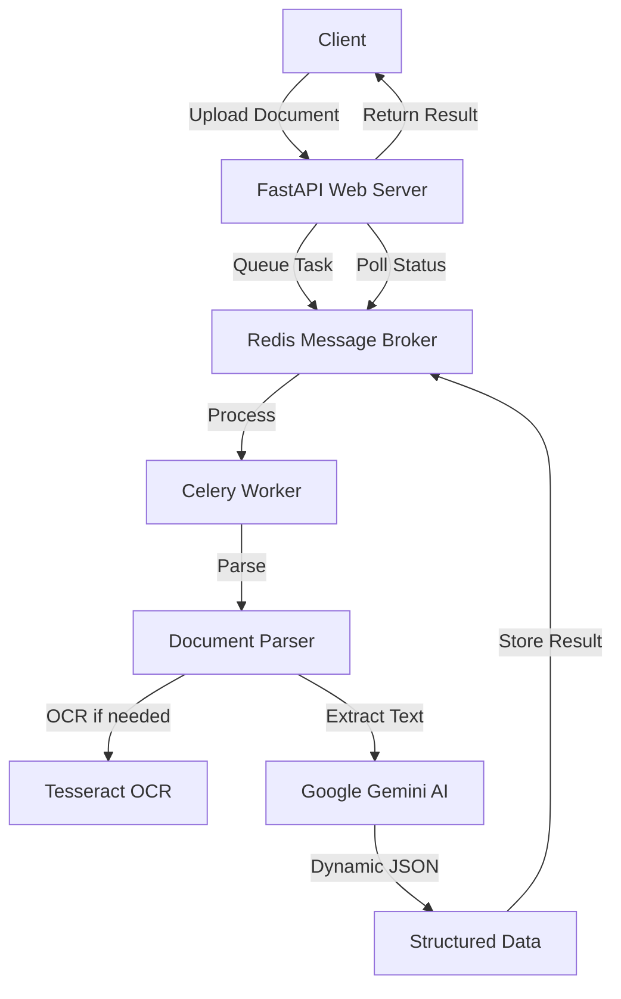

# 🚀 Large Document Processing API

[](https://github.com/endrilickollari/ldp/actions/workflows/simple-build.yml)
[](https://github.com/endrilickollari/ldp/actions/workflows/test.yml)
[](https://github.com/endrilickollari/ldp/actions/workflows/quick-test.yml)

> **Advanced AI-Powered Document Analysis with Dynamic Schema Generation**

An enterprise-grade asynchronous document processing service that leverages Google Gemini AI to intelligently extract and structure data from any type of business document. Unlike traditional systems with rigid schemas, this API uses dynamic AI-driven analysis to create optimal data structures tailored to each document's content.

## 📋 Table of Contents

- [✨ Key Features](#-key-features)
- [🏛️ Architecture](#-architecture)
- [🚀 Quick Start](#-quick-start)
- [📡 API Reference](#-api-reference)
- [🧪 Testing](#-testing)
- [🔄 CI/CD Workflows](#-cicd-workflows)
- [🐳 Docker Deployment](#-docker-deployment)
- [📊 Performance & Scalability](#-performance--scalability)
- [🛡️ Security & Compliance](#-security--compliance)
- [� Contributing](#-contributing)
- [🎯 Roadmap](#-roadmap)

## ✨ Key Features

### �🧠 **Intelligent Dynamic Schema Generation**
- **No Predefined Schemas**: AI analyzes document content and creates optimal JSON structures automatically
- **Adaptive Processing**: Handles receipts, contracts, reports, and any business document type
- **Comprehensive Data Extraction**: Captures ALL available information, not just predefined fields
- **Multi-Language Support**: Processes documents in any language

### 📄 **Universal Document Support**
- **PDFs**: Text-based and image-based (with OCR)
- **Excel Files**: .xlsx and .xls formats
- **Images**: .png, .jpg, .jpeg (with OCR)
- **Smart Processing**: Automatically detects document type and applies appropriate extraction methods

### 🏗️ **Production-Ready Architecture**
- **Asynchronous Processing**: Non-blocking API with real-time status updates
- **Scalable Design**: Web-Queue-Worker architecture using FastAPI, Celery, and Redis
- **Stateless Workers**: Horizontal scaling ready
- **Robust Error Handling**: Comprehensive logging and error recovery

### 🔍 **Advanced Data Extraction**
- **Context-Aware Analysis**: AI understands document context and relationships
- **Precise Value Extraction**: Preserves exact numbers, dates, and formatting
- **Hierarchical Structuring**: Creates nested objects for related data
- **Metadata Capture**: Extracts system codes, reference numbers, and technical details

### 📄 **Multi-Page Document Processing**
- **Page Range Selection**: Process specific pages (e.g., pages 5-10 of a contract)
- **Per-Page Analysis**: Get structured data for each page individually
- **Flexible Output Formats**: Choose between combined or per-page results
- **Large Document Optimization**: Efficient processing of lengthy documents

## 🏛️ Architecture



### Components
- **🌐 Web Tier**: FastAPI REST API for file uploads and status monitoring
- **🔄 Queue Tier**: Redis message broker with Celery task management
- **⚡ Worker Tier**: Asynchronous document processing with AI analysis
- **🤖 AI Tier**: Google Gemini LLM for intelligent content structuring

## 🚀 Quick Start

### Prerequisites
- Python 3.11+
- Redis server
- Tesseract OCR
- Google Gemini API key

### Installation

#### 1. Install System Dependencies

```bash
# macOS
brew install tesseract redis

# Ubuntu/Debian  
sudo apt-get update
sudo apt-get install tesseract-ocr tesseract-ocr-eng libtesseract-dev poppler-utils redis-server

# Windows (using Chocolatey)
choco install tesseract redis
```

#### 2. Clone and Setup Project

```bash
git clone https://github.com/endrilickollari/ldp.git
cd ldp
python -m venv venv
source venv/bin/activate  # On Windows: venv\Scripts\activate
pip install -r requirements.txt
pip install flower  # For Celery monitoring
```

#### 3. Configure Environment

Create a `.env` file with your configuration:

```env
GOOGLE_API_KEY=your-google-gemini-api-key-here
CELERY_BROKER_URL=redis://localhost:6379/0
CELERY_RESULT_BACKEND=redis://localhost:6379/0
```

#### 4. Initialize Database

```bash
python init_db.py
```

#### 5. Start Services

```bash
# Terminal 1: Start Redis
redis-server

# Terminal 2: Start API Server
uvicorn app.main:app --host 0.0.0.0 --port 8000 --reload

# Terminal 3: Start Celery Worker
celery -A workers.celery_app worker --loglevel=info

# Terminal 4: Start Flower (optional - for monitoring)
celery -A workers.celery_app flower
```

### Using the Startup Script

For quick startup, use the provided script:

```bash
./start.sh
```

## 📡 API Reference

### Upload Document for Processing

```http
POST /v1/jobs
Content-Type: multipart/form-data
```

**Parameters:**
- `file` (required): The document file to process
- `page_start` (optional): Start page number (1-indexed, inclusive) for PDF processing
- `page_end` (optional): End page number (1-indexed, inclusive) for PDF processing  
- `output_format` (optional): Output format - `"combined"` (default) or `"per_page"`

**Basic Request:**
```bash
curl -X POST "http://localhost:8000/v1/jobs" \
  -H "Content-Type: multipart/form-data" \
  -F "file=@document.pdf"
```

**Advanced Request with Page Range:**
```bash
curl -X POST "http://localhost:8000/v1/jobs" \
  -H "Content-Type: multipart/form-data" \
  -F "file=@contract.pdf" \
  -F "page_start=5" \
  -F "page_end=10" \
  -F "output_format=per_page"
```

**Response:**
```json
{
  "job_id": "550e8400-e29b-41d4-a716-446655440000",
  "status": "queued",
  "status_url": "http://localhost:8000/v1/jobs/550e8400-e29b-41d4-a716-446655440000"
}
```

### Check Processing Status

```http
GET /v1/jobs/{job_id}
```

**Response (Combined Format):**
```json
{
  "job_id": "550e8400-e29b-41d4-a716-446655440000",
  "status": "SUCCESS",
  "stage": "Completed",
  "progress": 100,
  "result": {
    "output_format": "combined",
    "document_type": "contract",
    "vendor": { "name": "...", "tax_id": "..." },
    "line_items": [...],
    "preprocessing_metadata": {
      "pages_processed_start": 5,
      "pages_processed_end": 10,
      "pages_processed_count": 6
    }
  }
}
```

**Response (Per-Page Format):**
```json
{
  "job_id": "550e8400-e29b-41d4-a716-446655440000",
  "status": "SUCCESS",
  "stage": "Completed", 
  "progress": 100,
  "result": {
    "output_format": "per_page",
    "pages": [
      {
        "page_number": 5,
        "extraction_method": "text",
        "structured_data": {
          "section": "terms_and_conditions",
          "clauses": [...]
        }
      },
      {
        "page_number": 6,
        "extraction_method": "ocr",
        "structured_data": {
          "section": "pricing_schedule", 
          "items": [...]
        }
      }
    ],
    "preprocessing_metadata": { /* ... */ }
  }
}
```

### Interactive API Documentation

Visit `http://localhost:8000/docs` for the complete interactive API documentation powered by Swagger UI.

## 🧪 Testing

### Running Tests

```bash
# Run all tests
python -m pytest tests/ -v

# Run tests with coverage
python -m pytest tests/ --cov=app --cov=workers --cov-report=html

# Run specific test file
python -m pytest tests/test_auth.py -v

# Run tests with custom test runner
python run_tests.py
```

### Test Structure

```
tests/
├── conftest.py              # Test fixtures and configuration
├── test_api_keys.py         # API key authentication tests
├── test_auth.py             # Authentication system tests
├── test_companies.py        # Company management tests
├── test_jobs.py             # Document processing job tests
├── test_main.py             # Main application tests
├── test_plans.py            # User plan tests
└── test_user_service.py     # User service tests
```

### Test Coverage

Our test suite covers:
- **API Endpoints**: All REST API endpoints with various scenarios
- **Authentication**: JWT token validation and user management
- **Document Processing**: File upload and processing workflows
- **Database Operations**: User, company, and plan management
- **Error Handling**: Edge cases and error scenarios
- **Integration Tests**: End-to-end workflow testing

## 🔄 CI/CD Workflows

This project includes comprehensive GitHub Actions workflows for automated building, testing, and deployment.

### Available Workflows

#### 1. **Build and Publish App** (`build-and-publish.yml`)
**Comprehensive build and deployment workflow**

**Triggers:**
- Push to `main` or `develop` branches
- Pull requests to `main` branch
- Release events
- Manual trigger

**Features:**
- Builds the application with Python 3.11
- Installs system dependencies (Tesseract, Poppler, etc.)
- Runs the full test suite
- Creates comprehensive application packages with:
  - All source code and dependencies
  - Auto-generated startup scripts
  - Build documentation and metadata
  - Docker configuration files
- Publishes artifacts (30-90 day retention)
- Builds and pushes Docker images to GitHub Container Registry
- Attaches build artifacts to GitHub releases

#### 2. **Simple Build** (`simple-build.yml`)
**Lightweight workflow for quick builds**

**Features:**
- Fast build and test process
- Creates minimal application packages
- Perfect for development branches
- Uploads build artifacts to GitHub Actions

#### 3. **Comprehensive Tests** (`test.yml`)
**Full testing workflow with coverage reporting**

**Features:**
- Runs complete test suite with pytest
- Generates code coverage reports (HTML, XML, terminal)
- Uploads coverage to Codecov
- Tests Docker container functionality
- Creates detailed test reports and artifacts
- Supports matrix testing across Python versions
- Generates test summaries in GitHub Actions

#### 4. **Quick Tests** (`quick-test.yml`)
**Fast testing for rapid development feedback**

**Features:**
- Rapid test execution with fail-fast option
- Basic module import validation
- Minimal system dependency installation
- Quick feedback for development workflow

### Build Artifacts

All workflows create comprehensive zip packages containing:

- **Application Code**: Complete `app/`, `workers/`, `tests/` directories
- **Configuration Files**: `requirements.txt`, `docker-compose.yml`, `Dockerfile`, `pytest.ini`
- **Startup Scripts**: Auto-generated `start.sh` for one-command deployment
- **Database Setup**: `init_db.py`, `migrate_db.py` scripts
- **Documentation**: `README.md`, build metadata, and usage instructions

### Using Build Artifacts

#### Download from GitHub Actions
1. Go to the "Actions" tab in the GitHub repository
2. Click on a completed workflow run
3. Download the artifact zip file
4. Extract and run `./start.sh` to start the application

#### Download from Releases
1. Go to the "Releases" section
2. Download the attached zip file from any release
3. Extract and follow the setup instructions

### Manual Workflow Triggers

Trigger any workflow manually:
1. Go to the "Actions" tab
2. Select the desired workflow
3. Click "Run workflow"
4. Choose the branch and click "Run workflow"

### Docker Images

The workflows build and publish Docker images to GitHub Container Registry:

```bash
# Pull the latest image
docker pull ghcr.io/endrilickollari/ldp:latest

# Run the container
docker run -p 8000:8000 ghcr.io/endrilickollari/ldp:latest
```

## 🐳 Docker Deployment

### Full-Stack Application (Backend + Frontend)

The application now includes a React TypeScript frontend integrated with the FastAPI backend.

#### Quick Start with Docker Compose

```bash
# Clone and setup
git clone <repository>
cd ldp

# Copy environment file
cp .env.example .env
# Edit .env with your configuration (API keys, etc.)

# Build and start all services
docker-compose up -d

# View logs
docker-compose logs -f
```

#### Available Services

- **Frontend**: http://localhost:8000/ - React TypeScript web app
- **API**: http://localhost:8000/v1/ - FastAPI backend endpoints  
- **API Docs**: http://localhost:8000/docs - Interactive API documentation
- **Flower**: http://localhost:5555/ - Celery task monitor

#### Using Docker Build Script

```bash
# Use the convenient build script
./docker-build.sh

# Or build manually
docker-compose build --no-cache
```

### Individual Container Deployment

```bash
# Build the image (includes React frontend build)
docker build -t ldp-app .

# Run the container
docker run -p 8000:8000 -e GOOGLE_API_KEY=your-key ldp-app
```

### Docker Configuration

The multi-stage Dockerfile includes:

**Stage 1 - Frontend Build:**
- Node.js 18 Alpine for React TypeScript build
- npm ci for reliable dependency installation
- Production-optimized React build

**Stage 2 - Backend Runtime:**
- Python 3.11 slim base image
- System dependencies (Tesseract OCR, Poppler utilities)
- Python package installation with caching optimization
- Built React frontend from Stage 1
- Proper directory structure and permissions
- Health check endpoints

### Environment Variables

```bash
# Database
DATABASE_URL="sqlite:///./app.db"

# Celery/Redis  
CELERY_BROKER_URL="redis://redis:6379/0"
CELERY_RESULT_BACKEND="redis://redis:6379/0"

# AI Processing
GOOGLE_API_KEY="your-google-gemini-api-key"

# Authentication
SECRET_KEY="your-jwt-secret-key"

# React Frontend (optional, for custom API URL)
REACT_APP_API_URL="http://localhost:8000"
```

## 📊 Performance & Scalability

### Benchmarks

| Document Type | Avg Processing Time | Accuracy | Fields Extracted |
|---------------|-------------------|----------|------------------|
| Simple Contract | 3-5 seconds | 98%+ | 15-25 fields |
| Complex Multi-page PDF | 15-30 seconds | 95%+ | 50+ fields |
| Scanned Document | 10-20 seconds | 92%+ | 20-35 fields |
| Excel Spreadsheet | 2-8 seconds | 99%+ | All data cells |

### Scaling Guidelines

**Horizontal Scaling:**
```bash
# Add more workers
celery -A workers.celery_app worker --loglevel=info --concurrency=8

# Multiple worker nodes
celery -A workers.celery_app worker --hostname=worker1@%h
celery -A workers.celery_app worker --hostname=worker2@%h
```

**Production Deployment:**
```bash
# Using Gunicorn for API
gunicorn app.main:app -w 4 -k uvicorn.workers.UvicornWorker

# Redis Cluster for high availability
redis-sentinel /path/to/sentinel.conf
```

## 🛡️ Security & Compliance

### Data Privacy
- **No Data Persistence**: Documents processed in memory only
- **Secure Transmission**: All API calls over HTTPS in production
- **API Key Protection**: Environment-based configuration
- **Worker Isolation**: Stateless processing prevents data leaks

### Authentication & Authorization
- JWT-based authentication system
- User management with different access levels
- Company-based access control
- API key authentication for service-to-service calls

### GDPR Compliance
```python
# Optional data retention settings
RETAIN_PROCESSING_LOGS = False
ANONYMIZE_PERSONAL_DATA = True
DATA_RETENTION_DAYS = 0  # Immediate cleanup
```

## � Contributing

### Development Workflow

1. **Fork the repository**
2. **Create feature branch**: `git checkout -b feature/amazing-feature`
3. **Make changes and add tests**
4. **Run tests**: `python -m pytest tests/ -v`
5. **Commit changes**: `git commit -m 'Add amazing feature'`
6. **Push to branch**: `git push origin feature/amazing-feature`
7. **Open Pull Request**

### Development Setup

```bash
# Clone your fork
git clone https://github.com/your-username/ldp.git
cd ldp

# Create virtual environment
python -m venv venv
source venv/bin/activate

# Install dependencies
pip install -r requirements.txt
pip install pytest-cov pytest-html pytest-xdist

# Install pre-commit hooks (optional)
pip install pre-commit
pre-commit install

# Run tests to ensure everything works
python -m pytest tests/ -v
```

### Code Style

We follow PEP 8 and use automated formatting:

```bash
# Format code
black app/ workers/ tests/

# Lint code
flake8 app/ workers/ tests/

# Type checking
mypy app/ workers/
```

### Testing Guidelines

- Write tests for all new features
- Maintain test coverage above 80%
- Include both unit tests and integration tests
- Test error scenarios and edge cases
- Update tests when modifying existing functionality

## 🎯 Roadmap

### Version 2.1 - Enhanced Features
- [ ] **Multi-format Output**: Export to Excel, CSV, XML formats
- [ ] **Batch Processing**: Handle ZIP archives with multiple documents
- [ ] **Custom Templates**: User-defined extraction templates
- [ ] **Webhook Integration**: Real-time processing notifications
- [ ] **Enhanced UI**: Web dashboard for monitoring and management

### Version 2.2 - Advanced AI
- [ ] **Document Classification**: ML-based automatic categorization
- [ ] **Custom Model Training**: Fine-tune models for specific document types
- [ ] **Multi-model Support**: Integration with multiple AI providers
- [ ] **Advanced OCR**: Better handling of handwritten text and complex layouts

### Version 2.3 - Enterprise Features
- [ ] **Advanced Authentication**: LDAP/SAML integration
- [ ] **Audit Logging**: Comprehensive audit trail
- [ ] **Data Governance**: Advanced privacy and compliance features
- [ ] **Multi-tenant Architecture**: SaaS-ready deployment options

## 📞 Support & Documentation

- **Interactive API Docs**: [http://localhost:8000/docs](http://localhost:8000/docs)
- **GitHub Issues**: [Report bugs and request features](https://github.com/endrilickollari/ldp/issues)
- **GitHub Discussions**: [Community support and questions](https://github.com/endrilickollari/ldp/discussions)
- **Wiki**: [Additional documentation and guides](https://github.com/endrilickollari/ldp/wiki)

## 📄 License

This project is licensed under the MIT License - see the [LICENSE](LICENSE) file for details.

---

**Built with ❤️ using FastAPI, Celery, Redis, and Google Gemini AI**

*Last updated: August 2025*
