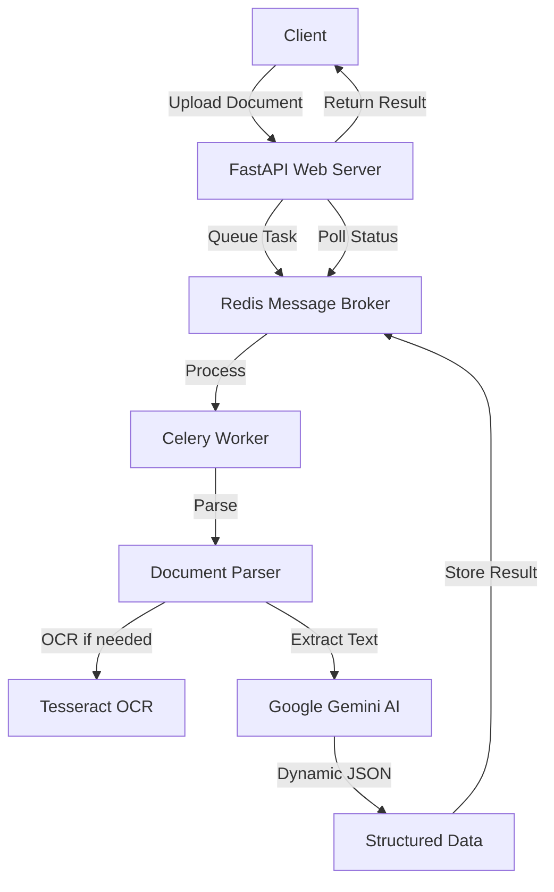

# 🚀 Intelligent Document Processing API

> **Advanced AI-Powered Document Analysis with Dynamic Schema Generation**

An enterprise-grade asynchronous document processing service that leverages Google Gemini AI to intelligently extract and structure data from any type of business document. Unlike traditional systems with rigid schemas, this API uses dynamic AI-driven analysis to create optimal data structures tailored to each document's content.

## ✨ Key Features

### 🧠 **Intelligent Dynamic Schema Generation**

- **No Predefined Schemas**: AI analyzes document content and creates optimal JSON structures automatically
- **Adaptive Processing**: Handles receipts, contracts, reports, and any business document type
- **Comprehensive Data Extraction**: Captures ALL available information, not just predefined fields
- **Multi-Language Support**: Processes documents in any language

### 📄 **Universal Document Support**

- **PDFs**: Text-based and image-based (with OCR)
- **Excel Files**: .xlsx and .xls formats
- **Images**: .png, .jpg, .jpeg (with OCR)
- **Smart Processing**: Automatically detects document type and applies appropriate extraction methods

### 🏗️ **Production-Ready Architecture**

- **Asynchronous Processing**: Non-blocking API with real-time status updates
- **Scalable Design**: Web-Queue-Worker architecture using FastAPI, Celery, and Redis
- **Stateless Workers**: Horizontal scaling ready
- **Robust Error Handling**: Comprehensive logging and error recovery

### 🔍 **Advanced Data Extraction**

- **Context-Aware Analysis**: AI understands document context and relationships
- **Precise Value Extraction**: Preserves exact numbers, dates, and formatting
- **Hierarchical Structuring**: Creates nested objects for related data (vendor details, line items, etc.)
- **Metadata Capture**: Extracts system codes, reference numbers, and technical details

## 🏛️ Architecture



### Components

- **🌐 Web Tier**: FastAPI REST API for file uploads and status monitoring
- **🔄 Queue Tier**: Redis message broker with Celery task management
- **⚡ Worker Tier**: Asynchronous document processing with AI analysis
- **🤖 AI Tier**: Google Gemini LLM for intelligent content structuring

## 🚀 Quick Start

### Prerequisites

- Python 3.8+
- Redis server
- Tesseract OCR
- Google Gemini API key

### Installation

#### 1. Install System Dependencies

```bash
# macOS
brew install tesseract redis

# Ubuntu/Debian  
sudo apt-get update
sudo apt-get install tesseract-ocr redis-server

# Windows (using Chocolatey)
choco install tesseract redis
```

#### 2. Clone and Setup Project

```bash
git clone <repository-url>
cd ldp
python3 -m venv venv
source venv/bin/activate  # On Windows: venv\Scripts\activate
pip install -r requirements.txt
```

#### 3. Configure Environment

```bash
cp .env.example .env
# Edit .env and add your Google Gemini API key
```

Required environment variables:

```env
GOOGLE_API_KEY=your-google-gemini-api-key-here
CELERY_BROKER_URL=redis://localhost:6379/0
CELERY_RESULT_BACKEND=redis://localhost:6379/0
```

#### 4. Start Services

```bash
# Terminal 1: Start Redis
redis-server

# Terminal 2: Start API Server
uvicorn app.main:app --reload

# Terminal 3: Start Worker
celery -A workers.celery_app worker --loglevel=info
```

## 📡 API Reference

### Upload Document for Processing

```http
POST /v1/jobs
Content-Type: multipart/form-data
```

**Request:**

```bash
curl -X POST "http://localhost:8000/v1/jobs" \
  -H "Content-Type: multipart/form-data" \
  -F "file=@document.pdf"
```

**Response:**

```json
{
  "job_id": "550e8400-e29b-41d4-a716-446655440000",
  "status": "queued",
  "status_url": "http://localhost:8000/v1/jobs/550e8400-e29b-41d4-a716-446655440000"
}
```

### Check Processing Status

```http
GET /v1/jobs/{job_id}
```

**Response (In Progress):**

```json
{
  "job_id": "550e8400-e29b-41d4-a716-446655440000",
  "status": "PROGRESS",
  "stage": "Analyzing with Gemini",
  "progress": 70
}
```

**Response (Completed):**

```json
{
  "job_id": "550e8400-e29b-41d4-a716-446655440000",
  "status": "SUCCESS",
  "stage": "Completed",
  "progress": 100,
  "result": {
    // AI-generated dynamic JSON structure based on document content
    "document_type": "contract",
    "vendor": { "name": "...", "tax_id": "..." },
    "line_items": [...],
    // ... comprehensive structured data
  }
}
```

## 🔧 Configuration Options

### Document Processing Settings

```python
# workers/tasks.py - Customizable settings

# OCR Resolution for image-based PDFs
PDF_OCR_RESOLUTION = 300

# Supported file extensions
SUPPORTED_EXTENSIONS = {
    'pdf': ['.pdf'],
    'excel': ['.xlsx', '.xls'], 
    'image': ['.png', '.jpg', '.jpeg']
}

# Gemini Model Configuration
GEMINI_MODEL = 'gemini-1.5-pro-latest'
RESPONSE_FORMAT = {"response_mime_type": "application/json"}
```

### Celery Worker Settings

```python
# workers/celery_app.py

# Task retry configuration
retry_kwargs = {'max_retries': 3}
retry_backoff = True

# Worker concurrency
celery -A workers.celery_app worker --loglevel=info --concurrency=4
```

## 🎯 Use Cases

### Financial Document Processing

- **Contracts**: Service agreements, purchase orders, legal documents
- **Reports**: Financial reports, business analytics, survey data
- **Receipts**: Purchase receipts, expense reports, transaction records
- **Forms**: Application forms, registration documents, questionnaires
- **Receipts**: Expense receipts with line item breakdown
- **Financial Statements**: Balance sheets, P&L statements
- **Tax Documents**: VAT returns, tax certificates

### Business Document Analysis

- **Contracts**: Legal agreements with parties and terms
- **Purchase Orders**: B2B transaction documents
- **Inventory Reports**: Stock levels and valuations
- **Compliance Forms**: Regulatory submissions

### Data Migration Projects

- **Legacy System Migration**: Extract structured data from old document formats
- **Digital Transformation**: Convert paper/PDF processes to structured data
- **Data Warehousing**: Feed document data into analytics systems
- **Compliance Archives**: Structure historical documents for searchability

## 🔍 Advanced Features

### Intelligent Document Type Detection

The AI automatically identifies document types and adapts extraction accordingly:

```json
{
  "document_type": "contract",          // Auto-detected
  "confidence_score": 0.95,            // Detection confidence
  "processing_strategy": "legal_document",
  "detected_language": "English",
  "extracted_entities": [...],
  // ... structured content
}
```

### Multi-Currency Support

Handles complex financial documents with currency conversions:

```json
{
  "financial_summary": {
    "primary_currency": "EUR",
    "secondary_currency": "LEK", 
    "exchange_rate": "1x97.23",
    "totals": {
      "eur": 1600.0,
      "lek": 155568.0
    }
  }
}
```

### Hierarchical Data Structuring

Creates logical nested structures for related information:

```json
{
  "parties": {
    "vendor": {
      "identity": { "name": "...", "tax_id": "..." },
      "contact": { "address": "...", "phone": "..." }
    },
    "customer": {
      "identity": { "name": "...", "tax_id": "..." },
      "billing_address": "...",
      "shipping_address": "..."
    }
  }
}
```

## 📊 Performance & Scalability

### Benchmarks

| Document Type | Avg Processing Time | Accuracy | Fields Extracted |
|---------------|-------------------|----------|------------------|
| Simple Contract | 3-5 seconds | 98%+ | 15-25 fields |
| Complex Multi-page PDF | 15-30 seconds | 95%+ | 50+ fields |
| Scanned Document | 10-20 seconds | 92%+ | 20-35 fields |
| Excel Spreadsheet | 2-8 seconds | 99%+ | All data cells |

### Scaling Guidelines

**Horizontal Scaling:**

```bash
# Add more workers
celery -A workers.celery_app worker --loglevel=info --concurrency=8

# Multiple worker nodes
celery -A workers.celery_app worker --hostname=worker1@%h
celery -A workers.celery_app worker --hostname=worker2@%h
```

**Production Deployment:**

```bash
# Using Gunicorn for API
gunicorn app.main:app -w 4 -k uvicorn.workers.UvicornWorker

# Redis Cluster for high availability
redis-sentinel /path/to/sentinel.conf
```

## 🛡️ Security & Compliance

### Data Privacy

- **No Data Persistence**: Documents processed in memory only
- **Secure Transmission**: All API calls over HTTPS
- **API Key Protection**: Environment-based configuration
- **Worker Isolation**: Stateless processing prevents data leaks

### GDPR Compliance

```python
# Optional data retention settings
RETAIN_PROCESSING_LOGS = False
ANONYMIZE_PERSONAL_DATA = True
DATA_RETENTION_DAYS = 0  # Immediate cleanup
```

## 🧪 Testing

### Unit Tests

```bash
# Run test suite
python -m pytest tests/

# Test specific component
python -m pytest tests/test_document_processing.py

# Coverage report
python -m pytest --cov=app --cov=workers tests/
```

### Integration Testing

```bash
# Test complete pipeline
python test_api.py

# Load testing
locust -f tests/load_test.py --host=http://localhost:8000
```

## 🚀 Deployment

### Docker Deployment

```dockerfile
# Dockerfile provided
docker build -t document-processor .
docker run -p 8000:8000 document-processor
```

### Production Checklist

- [ ] Configure proper Redis persistence
- [ ] Set up SSL certificates for HTTPS
- [ ] Configure logging and monitoring (ELK stack, Prometheus)
- [ ] Set up backup and disaster recovery
- [ ] Configure auto-scaling policies
- [ ] Implement rate limiting and authentication
- [ ] Set up health checks and alerts

## 🤝 Contributing

1. Fork the repository
2. Create feature branch: `git checkout -b feature/amazing-feature`
3. Commit changes: `git commit -m 'Add amazing feature'`
4. Push to branch: `git push origin feature/amazing-feature`
5. Open Pull Request

### Development Setup

```bash
# Install development dependencies
pip install -r requirements-dev.txt

# Run linting
flake8 app/ workers/
black app/ workers/

# Type checking
mypy app/ workers/
```

## 📝 License

This project is licensed under the MIT License - see the [LICENSE](LICENSE) file for details.

## 🎯 Roadmap

### Version 2.0 Planned Features

- [ ] **Multi-format Output**: Export to Excel, CSV, XML
- [ ] **Batch Processing**: Handle ZIP archives with multiple documents
- [ ] **Custom Templates**: User-defined extraction templates
- [ ] **Webhook Integration**: Real-time notifications
- [ ] **Dashboard UI**: Web interface for monitoring and management
- [ ] **API Authentication**: JWT-based security
- [ ] **Document Classification**: ML-based automatic document categorization
- [ ] **Version Control**: Track document processing history

## 📞 Support

- **Documentation**: [API Docs](http://localhost:8000/docs)
- **Issues**: [GitHub Issues](https://github.com/your-repo/issues)
- **Discussions**: [GitHub Discussions](https://github.com/your-repo/discussions)

---

Built with ❤️ using FastAPI, Celery, Redis, and Google Gemini AI
